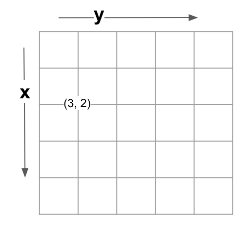

# Overview
This is a project to develop animated components for flowcharts using **React.js**, **Bootstrap**, and **Tailwind CSS**.

This a starter project for React.js.

# How to Use
1. Install `node.js`.
2. run `yarn` to install all packages.

# Canvas Grid Coordination
